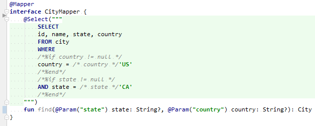

# MyBatis 2Way SQL Scripting Plugin

I tried to make [2-Way SQL](https://doma.readthedocs.io/ja/doma-3/sql/#id8) available on MyBatis.

Following is syntax highlighting(IntelliJ + Kotlin).

This is not a realistic approach because it fully incorporates [Doma](https://github.com/domaframework/doma)'s jar. 

You had better use Doma instead of MyBatis, if you want to use **2-Way SQL**.

